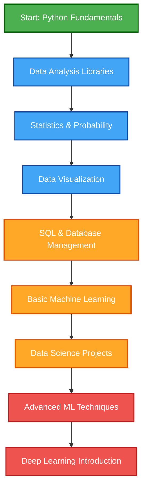

# 
🚀 Welcome to My Data Science Journey 🚀

  

  
  
  

## 📊 About Me 

Hello world! I'm an enthusiastic beginner on the exciting path to becoming a **Data Scientist**. I'm passionate about uncovering insights from data and learning the tools that make this possible. This repository documents my learning journey, projects, and growth in the field of data science.

> *"The journey of a thousand miles begins with a single line of code."*

## 💡 Currently Learning

  <table>
    <tr>
      <td align="center" width="96">
        
         Python
      </td>
      <td align="center" width="96">
        
         Pandas
      </td>
      <td align="center" width="96">
        
         NumPy
      </td>
      <td align="center" width="96">
        
         Matplotlib
      </td>
      <td align="center" width="96">
        
         Seaborn
      </td>
      <td align="center" width="96">
        
         SQL
      </td>
    </tr>
  </table>

- 📚 Fundamentals of statistics and probability for data analysis
- 📈 Data cleaning and preprocessing techniques
- 🧪 Exploratory data analysis methodologies
- 📘 Basic machine learning concepts

## 🌟 Learning Roadmap

## 📂 Learning Projects

- 🔍 **Data Exploration**: Simple datasets analysis to practice basic skills
- 🧹 **Data Cleaning**: Exercises on preprocessing techniques
- 📊 **Visualization Projects**: Creating insightful visualizations
- 🧩 **Programming Challenges**: Solutions to data-related coding challenges

## 📚 Resources I'm Using

  
  
  
  

📂 Projects
<td width="50%">
  <h3 align="center">Electric Power Consumption Analysis</h3>
  

    
      
    
  

  

    Exploratory Data Analysis on electricity consumption and weather data using Pandas, Seaborn, and Matplotlib.
  

</td>

## 🤝 Let's Connect!

  

## ⚡ Fun Fact

While I'm a beginner in data science, I believe that consistent learning and application create true expertise. Every project, no matter how small, is a step toward mastery!

  

---

  
  
  **Thanks for visiting my profile! Let's turn data into knowledge together!** 💻📊📈

